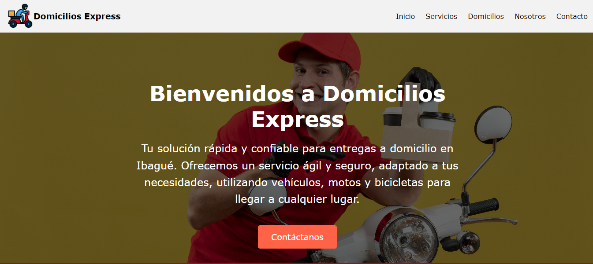

# Domicilios Express

## Descripción

**Domicilios Express** es una sitio web diseñada para facilitar la gestión de entregas rápidas en la ciudad de Ibagué, Tolima. La aplicación permite a los clientes solicitar la recogida y entrega de paquetes o pedidos de manera eficiente y segura. Nuestro enfoque es proporcionar un servicio confiable, utilizando vehículos, motocicletas, y bicicletas para satisfacer las necesidades de nuestros usuarios.

## Interfaz

## Funcionalidades

- **Inicio**: Página de bienvenida con información general sobre los servicios ofrecidos.
- **Servicios**: Detalles sobre los diferentes tipos de transporte y servicios de entrega disponibles.
- **Domicilios**: Permite a los usuarios gestionar sus solicitudes de entrega.
- **Nosotros**: Información sobre la empresa, su historia, equipo y valores corporativos.
- **Contacto**: Información de contacto y un formulario para consultas, junto con un mapa de la ubicación de la empresa.

## Tecnologías Utilizadas

- **Frontend**: React.js, CSS
- **Backend**: Node.js con Express (en desarrollo futuro)
- **Base de Datos**: MySQL (en desarrollo futuro)
- **Mapas**: Google Maps API

## Estructura del Proyecto

```bash
├── public/
│   ├── index.html
├── src/
│   ├── Components/
│   │   ├── Inicio.js
│   │   ├── Servicios.js
│   │   ├── Domicilios.js
│   │   ├── Nosotros.js
│   │   ├── Contacto.js
│   ├── Styles/
│   │   ├── Inicio.css
│   │   ├── Servicios.css
│   │   ├── Domicilios.css
│   │   ├── Nosotros.css
│   │   ├── Contacto.css
│   ├── img/
│   │   ├── img-inicio.jpg
│   │   ├── img-servicios.jpg
│   │   ├── img-domicilios.jpg
│   │   ├── img-nosotros.jpg
│   │   ├── img-contacto.jpg
│   ├── App.js
│   ├── App.css
│   ├── index.js
│   ├── index.css
├── README.md
├── package.json
```

## Instalación

1. Clona este repositorio: `git clone https://github.com/IvanPabon29/domicilios-express.git`
2. Navega al directorio del proyecto: `cd domicilios-express`
3. Instala las dependencias: `npm install`
4. Inicia la aplicación: `npm start`

## Contribuciones
¡Las contribuciones son bienvenidas! Si tienes ideas o mejoras, no dudes en crear un pull request o abrir un issue en el repositorio.

## Licencia
Este proyecto está licenciado bajo la Licencia MIT.


## Contacto
Para cualquier duda o consulta, puedes contactar con nosotros en:

Teléfono: +57 123 456 7890
Email: info@domiciliosexpress.com
Dirección: Manzana H Casa 17, Barrio Vasconia Reservado, Ibagué, Tolima
